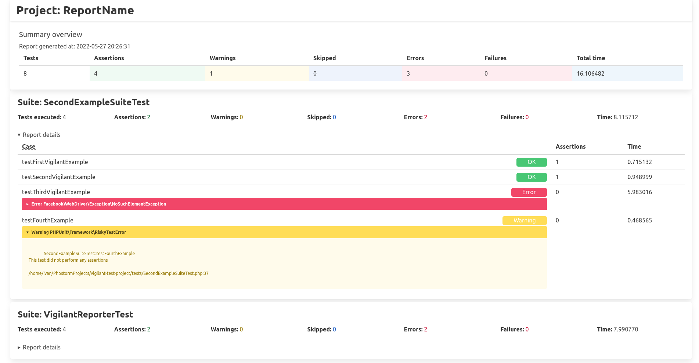

# Vigilant Report

**Vigilant Report** - is a tool for generating HTML/Console report based on xml file provided by PHPUnit.

## Install
```shell
composer require ivpel/vigilant-report
```

## How to use
Use `bin/console` to see all available commands with information how to use them.
```shell
bin/console
```
Use -h flag to see comment for command (how to use it etc.)
```shell
bin/console {commandName} -h
```
Generate HTML report based on PHPunit xml report.
```shell
bin/console generate:html-report <xml-report-location> [<generated-report-name>]
```

## Example
Example image of generated HTML report.
